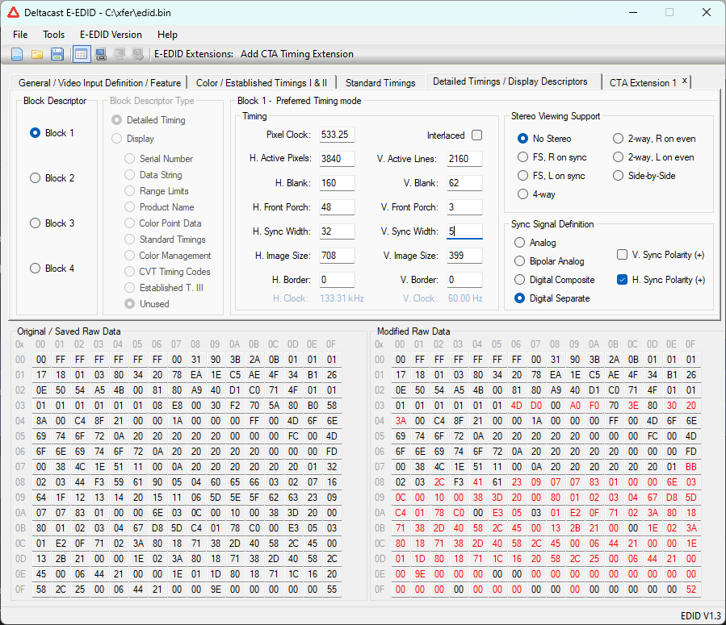

# Loading EDID File via Kernel Parameters
Validated on ```Linux raspberrypi 6.12.34+rpt-rpi-2712```

I was inpsired by the discussion on this [Raspberry Pi forum post](https://forums.raspberrypi.com/viewtopic.php?p=2155762&hilit=Hdmi+audio#p2153560) on how to load a custom EDID file using the kernel parameters.

This approach moves away from the "config.txt" way of setting custom timing and instead leverages the Direct Rendering Manager (DRM) to help interface with the graphics hardware in the Linux kernel. The Kernel Mode Setting (KMS) is responsible for configuration of the display mode for the hardware.

We will use the cmdline.txt configuration file to pass configurations for these subsystems to the Linux kernel at system boot.

### Grabbing an EDID
First, we will need an EDID file with the Raspberry Pi will conveniently grab when connecting to a monitor. To keep the setup simple, we'll use HDMI0 or known as ```HDMI-A-1``` in the filesystem.

After plugging into a monitor, the EDID is grabbed and stored in the filesystem at:

```
/sys/class/drm/card?-HDMI-A-1/edid
```

Since it's just a file, we can grab and store it locally at the Desktop and call it whatever is preferred. I creatively chose ```edid.bin```.

```
sudo cp /sys/class/drm/card?-HDMI-A-1/edid ~/Desktop/edid.bin
```

If you are curious what is in that file, you can leverage a helpful tool to decode the EDID file called ```edid-decode```.

This can be installed with

```
sudo apt install edid-decode
```

### Modifying an EDID binary
An EDID is purely a binary file but has a structured format as explained [here](https://www.extron.com/article/uedid) and defined by the [VESA Standard](https://glenwing.github.io/docs/VESA-EEDID-A2.pdf).

This can be editted with a hex editor but I like to leverage tools that do the work for me. The best one I've found is the [Deltacast EDID Editor](https://www.deltacast.tv/products/free-software/e-edid-editor/).



I modified the DTD 1 block because the first of the four blocks is intended to describe the display's preferred video timing. 

I also removed references to any similar timing resolutions to ensure only one specific timing is chosen.

TODO: add more info in what/how to modify

### Loading the EDID into Firmware
Once the EDID file is ready, we simply need to load it into the firmware of the Raspberry Pi and tell the Kernel to grab it.

From the location where the file is stored, you need can copy the file into the firmware folder.

```
sudo cp ~/Desktop/edid.bin /lib/firmware/
```

We need to modify the the cmdline.txt file with:

```
sudo nano /boot/firmware/cmdline.txt
```
Then add the following to the beginning of the file:

```
drm.edid_firmware=HDMI-A-1:edid.bin video=HDMI-A-1:D
```
The first argument loads our EDID for the first HDMI port. The second argument tell the HDMI port to force the display to be enabled and use digital output with the suffix ```D```. More details on this setting can be found [here](https://docs.kernel.org/fb/modedb.html).